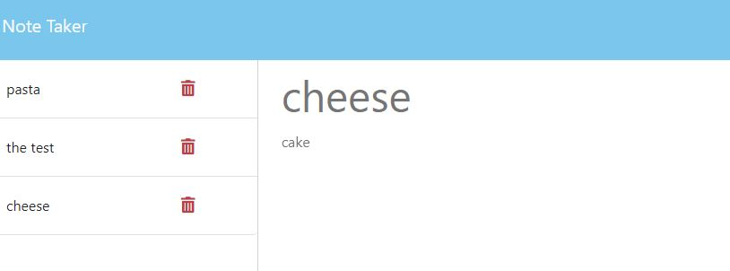

 
# UW-Bootcamp-Week11-NoteTaker 

## Description

I created this aplacation to replace the notes app on my app phone, I still don't under stand how to use it. The focus of this project was to practice using express and server function in both npm and heroku. Durring the creation I learnded how  to better write  server and routes js along with how to get them to interact.

## Table of Contents (Optional)

- [Installation](#installation)
- [Usage](#usage)
- [Credits](#credits)
- [License](#license)

## Installation

After pullin the starter code download download express , node, and uuid@8.3.2. then run a npm start or just go to the webite located below.

## Usage
Website: https://afternoon-atoll-97237.herokuapp.com/notes
To use this aplacation hit the get started button. After that type in your note and give it a title, then hit the save button. You can also display the old notes by clicking on the one you wish to view, or delete them by clicking the trash can next to the note you wish to delete.

;

## License

Copyright 2023, 

    Permission is hereby granted, free of charge, to any person obtaining a copy of this software and associated documentation files (the “Software”), to deal in the Software without 
    restriction, including without limitation the rights to use, copy, modify, merge, publish, distribute, sublicense, and/or sell copies of the Software, and to permit persons to whom 
    the Software is furnished to do so,subject to the following conditions:
    The above copyright notice and this permission notice shall be included in all copies or substantial portions of the Software.
    THE SOFTWARE IS PROVIDED “AS IS”, WITHOUT WARRANTY OF ANY KIND, EXPRESS OR IMPLIED, INCLUDING BUT NOT LIMITED TO THE WARRANTIES OF MERCHANTABILITY, FITNESS FOR A PARTICULAR PURPOSE 
    AND NONINFRINGEMENT. IN NO EVENT SHALL THE AUTHORS OR COPYRIGHT HOLDERS BE LIABLE FOR ANY CLAIM, DAMAGES OR OTHER LIABILITY, WHETHER IN AN ACTION OF CONTRACT, TORT OR OTHERWISE, 
    ARISING FROM, OUT OF OR IN CONNECTION WITH THE SOFTWARE OR THE USE OR OTHER DEALINGS IN THE SOFTWARE.
(https://opensource.org/licenses/MIT)
